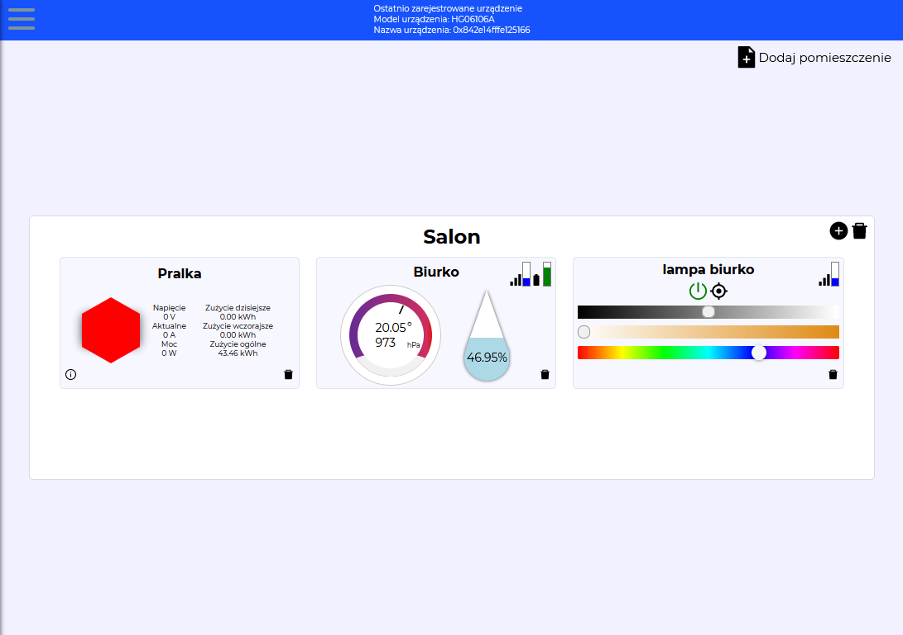
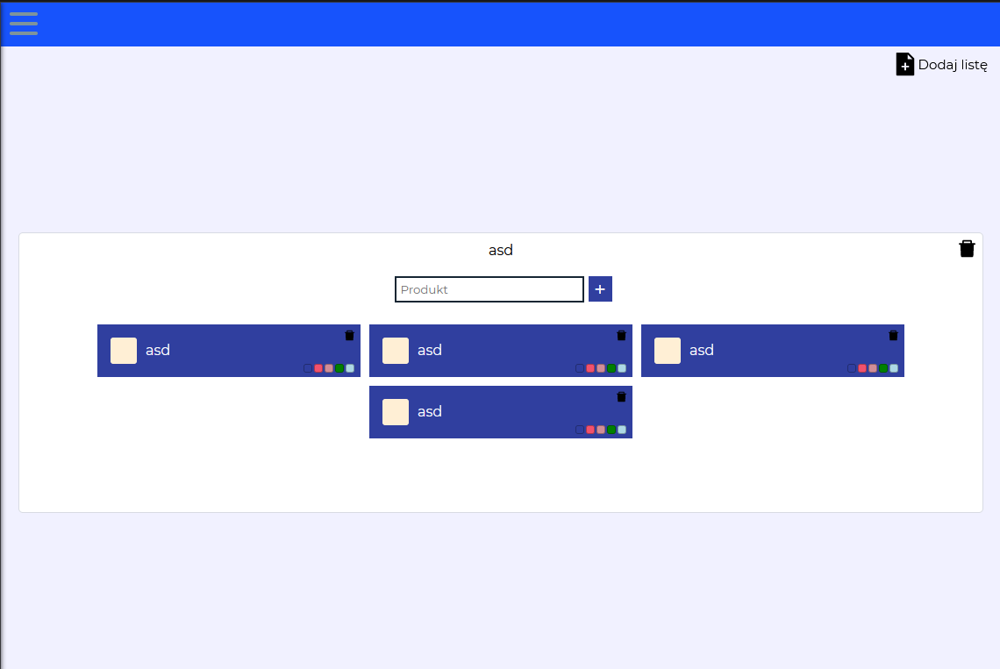
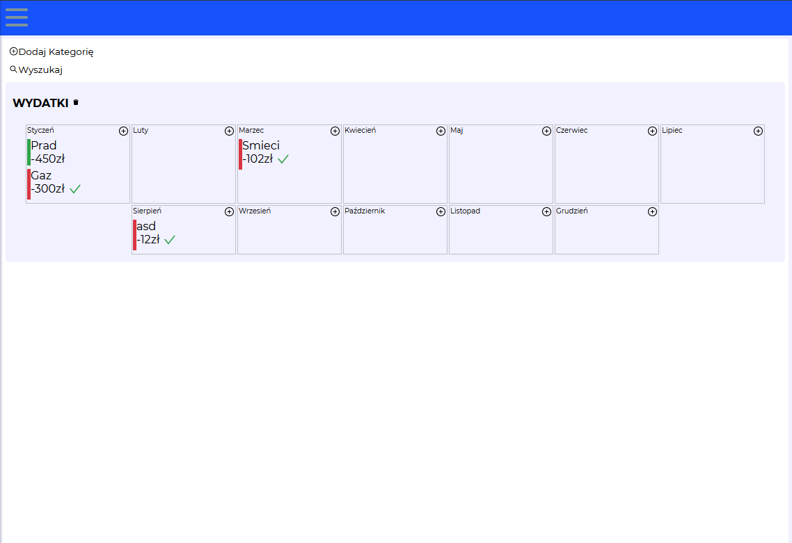
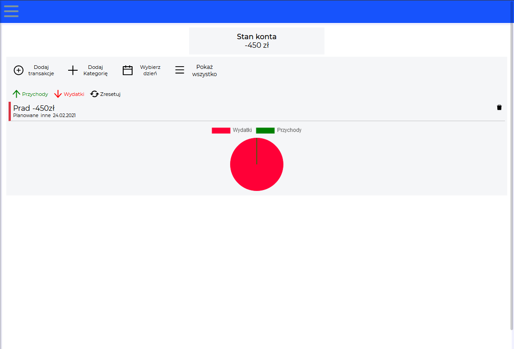
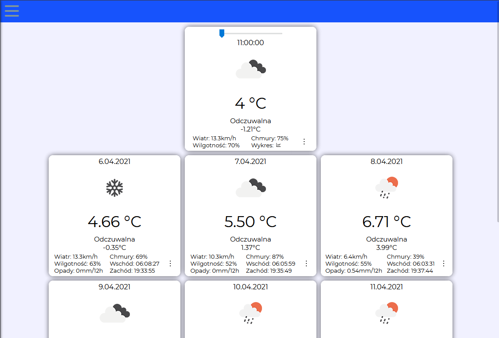

# Project overview

Smart home dashboard where i can connect with my sensors through mqtt and zigbee2mqtt.

## Technologies

- ReactJs
- Firebase
- RPI4
- MQTT
- Zigbee2mqtt
- NodeJs

## Demo

https://onandonhome.web.app/#/

## Images

